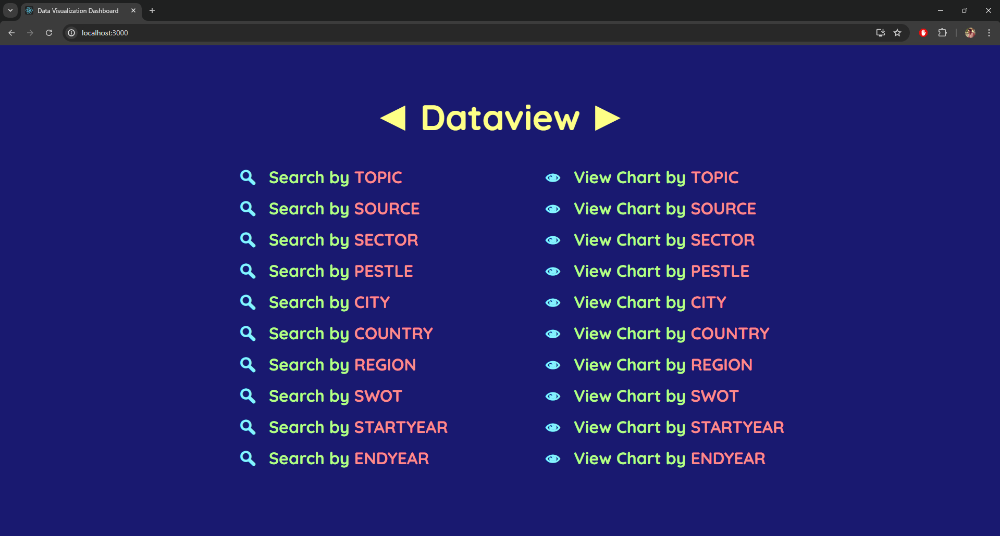
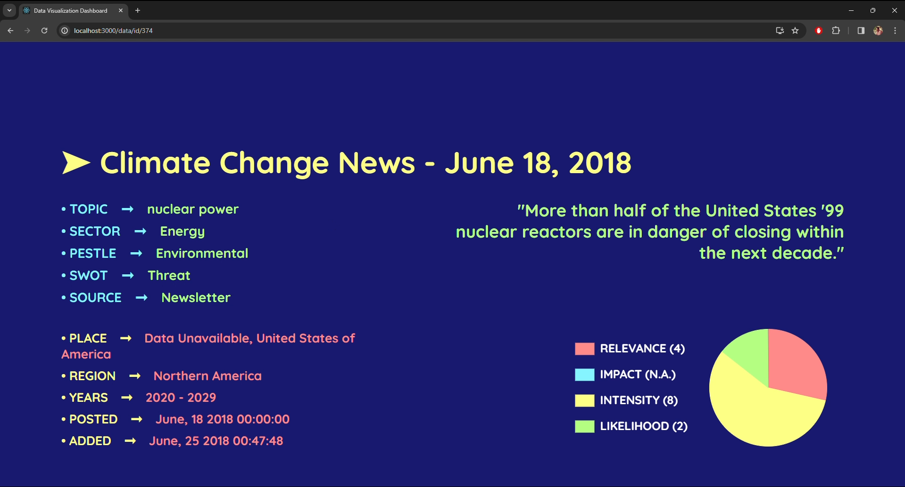
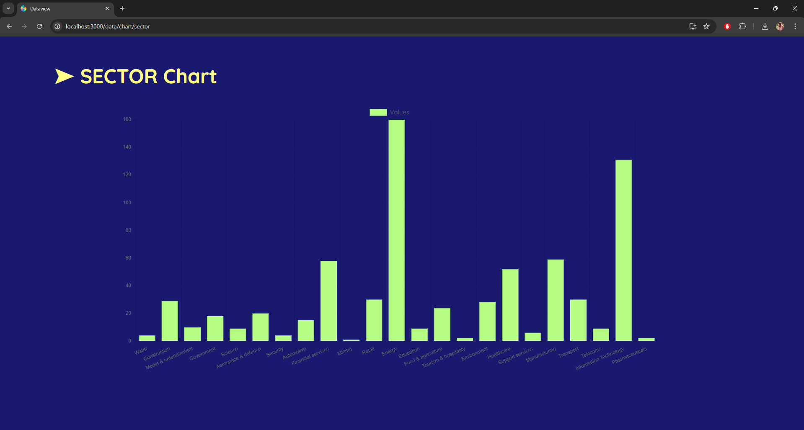

# data-visualisation-dashboard

**Description** : Web Application to Browse & Visualise large scale Data

**Tech Stack** : Spring Batch, Spring Boot, MySQL, ReactJS, ChartsJS, Bootstrap

**Overview** :

1. **Spring Batch** : Transfers large-scale data from CSV files to MySQL database efficiently
2. **Spring Boot** : Creates REST endpoints to fetch and manipulate data from MySQL database
3. **MySQL Database** : Stores and manages the data transferred from CSV files using Spring Batch
4. **ReactJS** : Uses React components to constructs dynamic user interfaces for frontend rendering
5. **ChartsJS**: Visualizes the data using interactive bar graphs and pie charts for presentation
6. **Bootstrap** : Provides responsive design and layout utilities for enhanced UI presentation

**How to Run (Windows)** :

1. Create Database called "Dashboard" in MySQL [**create database Dashboard;**]
2. Import Backend files to an IDE like Eclipse
3. Run Backend by running DashboardApplication.java file
4. Import Frontend files to an IDE like VSCode
5. Goto path "Frontend/dashboard/" in VSCode Terminal
6. Run commands [**npm install**] & [**npm install sass**] for necessary Node Modules
7. Run Frontend by running the command [**npm start**]
8. Go to [**http://localhost:3000**] on your Browser to access the Application

**Sample Screenshots** :

**API Documentation** :

1. **Retrieve All Data** -> GET /
2. **Retrieve Data by ID** -> GET /id/{id}
3. **Retrieve Data by Start Year** -> GET /startyear/{year}
4. **Retrieve Data by End Year** -> GET /endyear/{year}
5. **Retrieve Data by Topic** -> GET /topic/{topic}
6. **Retrieve Data by Sector** -> GET /sector/{sector}
7. **Retrieve Data by Region** -> GET /region/{region}
8. **Retrieve Data by SWOT** -> GET /swot/{swot}
9. **Retrieve Data by PESTLE** -> GET /pestle/{pestle}
10. **Retrieve Data by Source** -> GET /source/{source}
11. **Retrieve Data by City** -> GET /city/{city}
12. **Retrieve Data by City** -> GET /city/{city}
13. **Retrieve Data by Country** -> GET /country/{country}
14. **Retrieve All Start Years** -> GET /startyear/
15. **Retrieve All End Years** -> GET /endyear/
16. **Retrieve All Topics** -> GET /topic/
17. **Retrieve All Sectors** -> GET /sector/
18. **Retrieve All Regions** -> GET /region/
19. **Retrieve All SWOT Analyse**s -> GET /swot/
20. **Retrieve All PESTLE Analyses** -> GET /pestle/
21. **Retrieve All Sources** -> GET /source/
22. **Retrieve All Cities** -> GET /city/
23. **Retrieve All Countries** -> GET /country/
24. **Retrieve Start Year Frequency for Chart** -> GET /chart/startyear/
25. **Retrieve End Year Frequency for Chart** -> GET /chart/endyear/
26. **Retrieve Topic Frequency for Chart** -> GET /chart/topic/
27. **Retrieve Sector Frequency for Chart** -> GET /chart/sector/
28. **Retrieve Region Frequency for Chart** -> GET /chart/region/
29. **Retrieve SWOT Frequency for Chart** -> GET /chart/swot/
30. **Retrieve PESTLE Frequency for Chart** -> GET /chart/pestle/
31. **Retrieve Source Frequency for Chart** -> GET /chart/source/
32. **Retrieve City Frequency for Chart** -> GET /chart/city/
33. **Retrieve Country Frequency for Chart** -> GET /chart/country/

