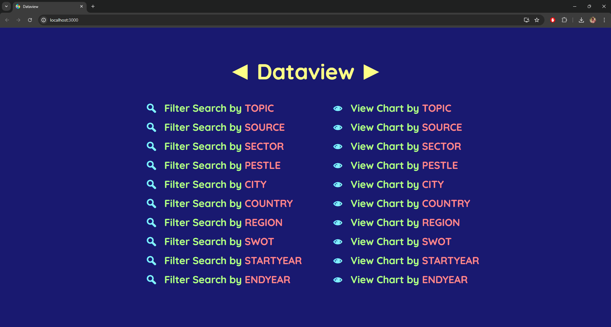
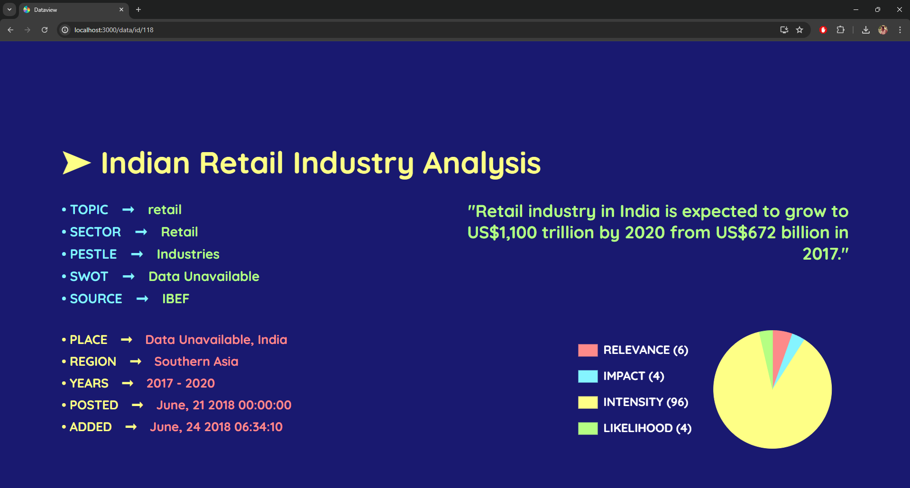

# data-visualisation-dashboard

**Description** : Web Application to Browse and Visualise large scale Data

**Requisite** : Make sure you have Java and NodeJS installed in your System

**How to Run (Windows)** :

1. Create Database called "Dashboard" in MySQL [**create database Dashboard;**]

2. Import Backend files to an IDE like Eclipse

3. Run Backend by executing DashboardApplication.java file

4. Import Frontend files to an IDE like VSCode

5. Goto path "Frontend/dashboard/" in Terminal

6. Run commands [**npm install**] & [**npm install sass**] for necessary Node Modules

7. Run Frontend by executing the command [**npm start**]

8. Go to http://localhost:3000 on your Browser to access the Application

**Sample Screenshot** :

